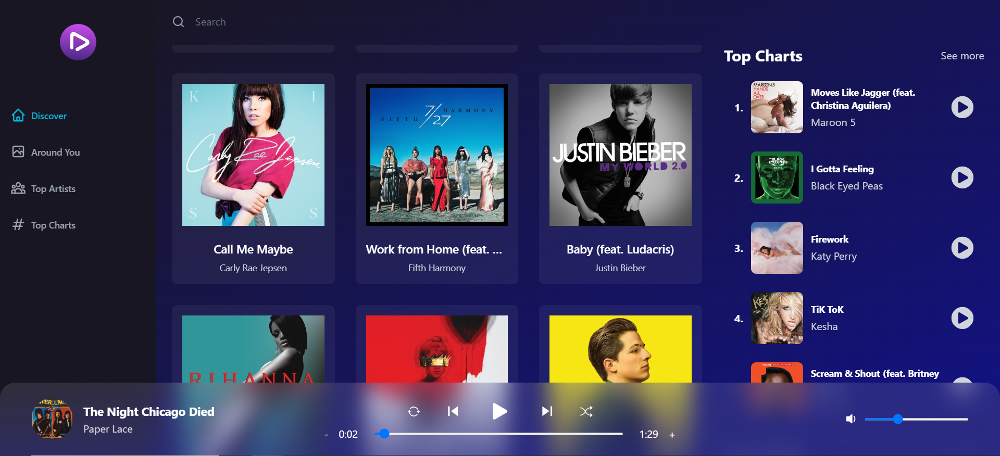

# Tuneify

Tuneify is a web application designed to bring a Spotify-like experience to users. It allows users to explore top music, top artists, and popular tracks specific to their country. Users can search for songs, play music, shuffle playlists, and choose specific tracks to play.

## Features

- **Discover Top Music:** Explore the latest and most popular tracks across various genres.
- **Top Artists:** View and listen to tracks by top artists.
- **Localized Music:** Find out what's trending in your country.
- **Search Functionality:** Quickly search for your favorite songs or artists.
- **Music Playback:** Play, pause, and control the playback of music.
- **Playlist Management:** Shuffle playlists or choose specific tracks to play.

## Demo

Check out Tuneify [here](https://ornate-clafoutis-9dd8dd.netlify.app/).

## Screenshot


_Home Page with search and trending music_

## Installation

To get started with Tuneify, follow these steps:

1. **Clone the repository:**

   ```bash
   git clone https://github.com/AhmedElsayed200/Tuneify.git
   cd tuneify
   ```

2. **Install dependencies:**
   Make sure you have Node.js installed. Then, install the required dependencies by running:
   ```bash
   npm install
   ```
3. **Run the application:**
   Start the development server with:
   ```bash
   npm run dev
   ```
   The application will be available at http://localhost:3000.

## API

Tuneify uses the Shazam Core API for fetching music data. The API is configured in the application with the following endpoints:

- **Get Songs by Genre**: songs/list-recommendations?id=${id}&limit=20
- **Get Song Info**: songs/get_details?id=${id}
- **Get Related Songs**: songs/list-recommendations?id=${id}&limit=20
- **Get Artist Details**: artist/get-details?id=${id}
- **Get Artist Songs**: artist/get-top-songs?id=${id}&offset=0
- **Search Songs**: search?term=${term}&limit=10
